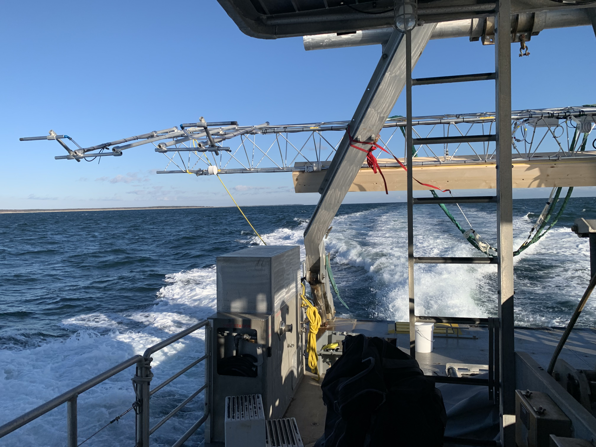
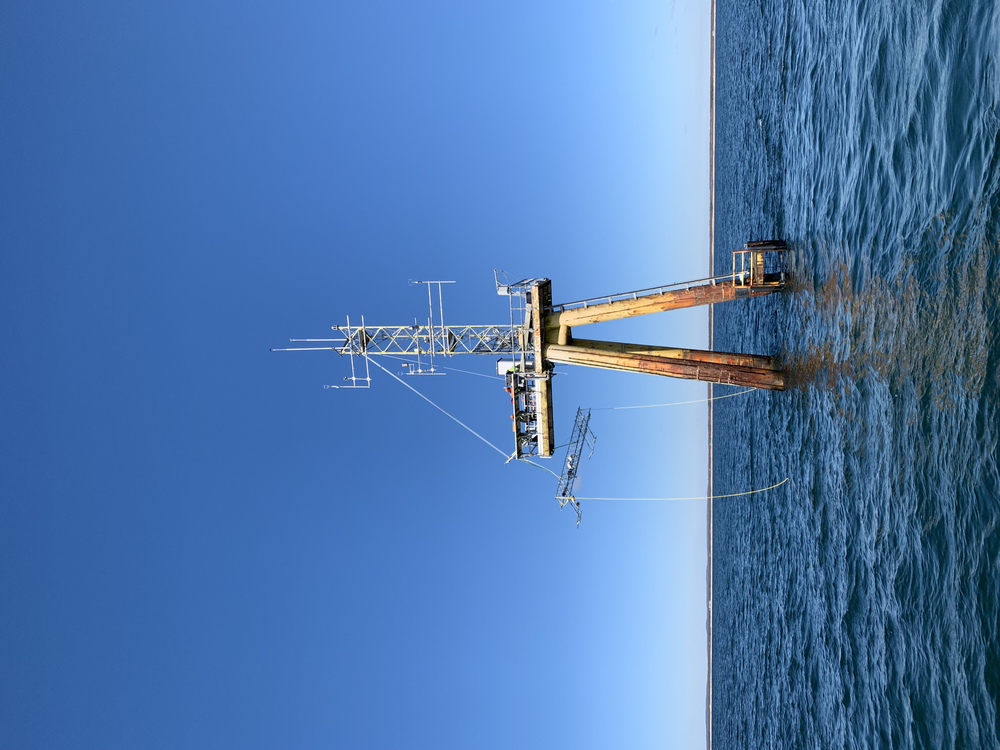
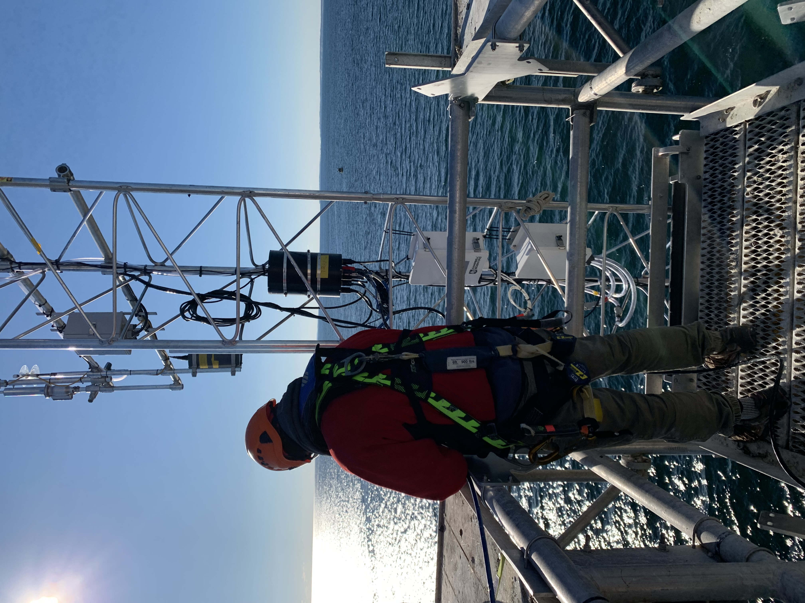
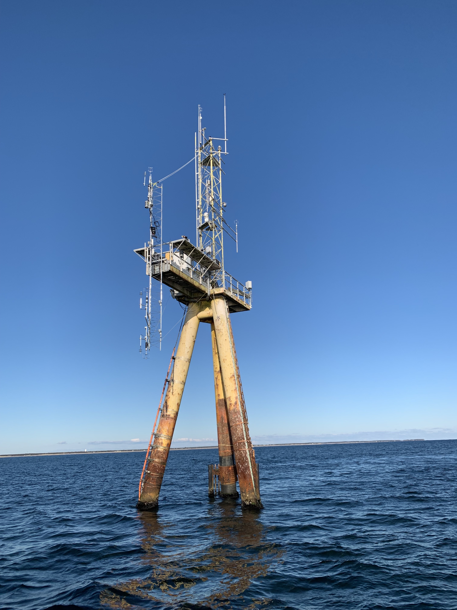

Earlier this month we deployed a suite of sensors on WHOI's ASIT (Air/Sea Interaction Tower) as part of a DOE-funded project to improve offshore wind forecasts. The focus of this deployment was to install sensors to measure and characterize the marine boundary layer. Several sensors are already maintained at ASIT, and we added additional capability by installing a 30-ft mast fixed to the diving board, the human-walkable platform at roughly 35ft above the water.

We transported the mast to ASIT using WHOI's R/V Tioga, strapping it horizontally to the back of the A-frame. The mast was too tall to fit upright on the Tioga without hitting the bottom of the diving board, and transporting it horizontally allowed us more maneuverability when picking the mast onto the tower.

It was a challenging pick. With winds much higher than were forecast for the day, the Tioga was unable to hold position for long underneath ASIT's diving board. This gave our team very little time to grab the hoisting line with a boathook, shackle the hoisting line to our lifting bridle on the mast, and hoist the mast clear of the Tioga's A-frame. 

With the mast clear of the Tioga, we had to rotate it upright and pull it above the diving board to install sensors which were removed to avoid possible damage during transfer from Tioga to ASIT. We ran into a small hiccup when the mast started to rotate due to the weight of the booms, but due to some quick thinking from the field team we were able to rotate the mast back into the intended position. 

Fortunately all of our sensors were working as expected and communicating with our data logger when powered on. Now, all that was needed were a few final tasks to further secure the mast in position, and to make sure our cables were fixed in place.

Because ASIT has a fiber-optic cable running along the sea floor connecting it to shore, we can check the data in real time. A good first check for data quality is to compare it against proven models and/or previously accepted data. So far, the data from the mast look like they are in agreement with "bulk" methods for determining air/sea fluxes of momentum and heat.

